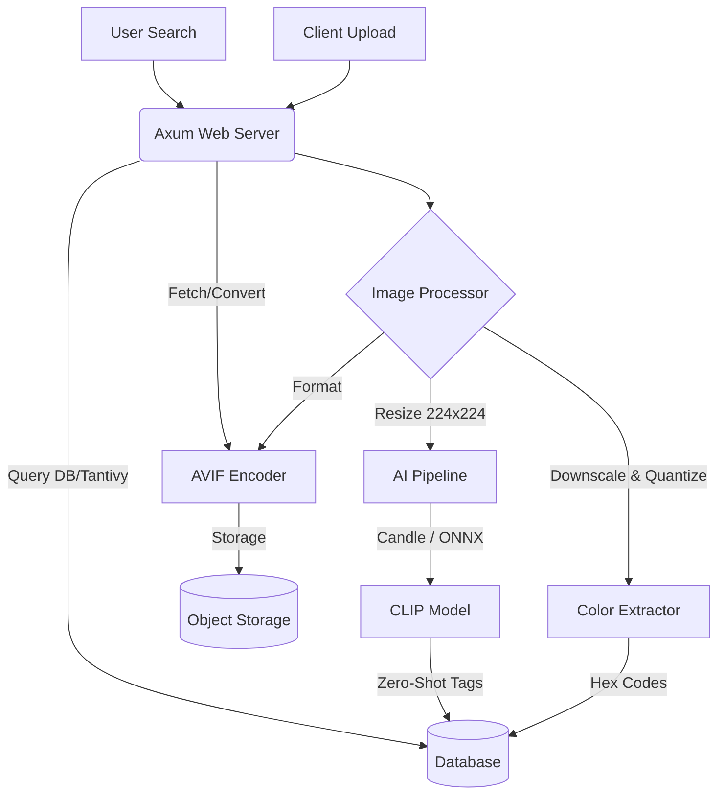

# Wallr

A hyper-optimized, pure-Rust backend for a next-generation wallpaper platform. This system enforces strict standards (AVIF-first), zero-latency on-demand conversions, and runs an entirely locally-hosted AI tagging pipeline with zero Python dependencies.

## 🚀 The "Optimal" Philosophy
- **Pure Rust:** No Python microservices for AI. No Node.js. High concurrency, minimal memory footprint.
- **AVIF Native:** All masters are stored in AVIF. Legacy formats (JPEG/PNG) are generated entirely on-demand and cached at the edge.
- **Local AI (Zero-Cost):** Image auto-tagging (categories, themes, subjects) is done on bare metal using Hugging Face's `candle` crate and quantized CLIP models.
- **Instant Search:** Tag querying backed by `tantivy` (Rust native search engine) or PostgreSQL (`pgvector`).

## 🏗 System Architecture

## 📦 Tech Stack

  - Web Framework: axum + tokio (for maximum async throughput).
  - Image Processing: fast_image_resize (SIMD-accelerated resizing) + image
    crate.
  - AVIF Encoding: ravif (pure Rust AVIF encoder, insanely fast).
  - AI Inference: candle-core & candle-nn (Hugging Face's minimalist ML
    framework for Rust) or ort (ONNX Runtime).
  - Color Extraction: Custom K-Means clustering (SIMD optimized) on 64x64
    thumbnails.
  - Database: PostgreSQL (with sqlx).
