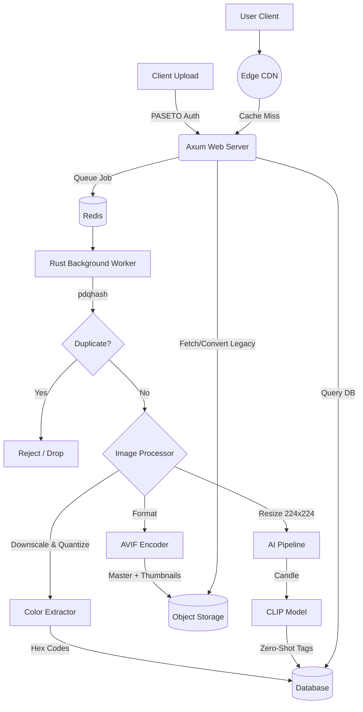

# Wallr

A hyper-optimized, pure-Rust backend for a next-generation wallpaper platform. This system enforces strict standards (AVIF-first), zero-latency on-demand conversions, and runs an entirely locally-hosted AI tagging pipeline with zero Python dependencies.

## 🚀 The "Optimal" Philosophy
- **Pure Rust:** No Python microservices for AI. No Node.js. High concurrency, minimal memory footprint.
- **AVIF Native:** All masters are stored in AVIF. Legacy formats (JPEG/PNG) are generated entirely on-demand and cached at the edge.
- **Local AI (Zero-Cost):** Image auto-tagging (categories, themes, subjects) is done on bare metal using Hugging Face's `candle` crate and quantized CLIP models.
- **Instant Search:** Tag querying backed by PostgreSQL (`pgvector`).

## 🏗 Backend Architecture

## 📦 Tech Stack

### Frontend
- **Framework:** Dioxus 0.7.9 (Web & Desktop targets).
- **Design System:** Custom CSS (glassmorphic UI).
- **Icons:** lucide-dioxus.

### Backend
- **Web Framework:** axum + tokio & Dioxus Server Functions (for maximum async throughput).
- **Security & Auth:** PASETO tokens (`pasetors`), Argon2 hashing, and content filtering (`rustrict`).
- **Deduplication:** Perceptual image hashing (`pdqhash`, `img_hash`) and `bk-tree` for fast collision lookups.
- **Database:** PostgreSQL (with sqlx for compile-time verified queries).
- **Queue & Cache:** Redis (for async background workers and caching).
- **Image Processing:** fast_image_resize (SIMD-accelerated) + image crate.
- **AVIF Encoding:** ravif (pure Rust AVIF encoder, insanely fast).
- **AI Inference:** candle-core & candle-nn (Hugging Face's minimalist ML framework for Rust).
- **Color Extraction:** Custom K-Means clustering (SIMD optimized) on 64x64 thumbnails.
- **Edge Delivery:** Global CDN for aggressively caching image formats.
